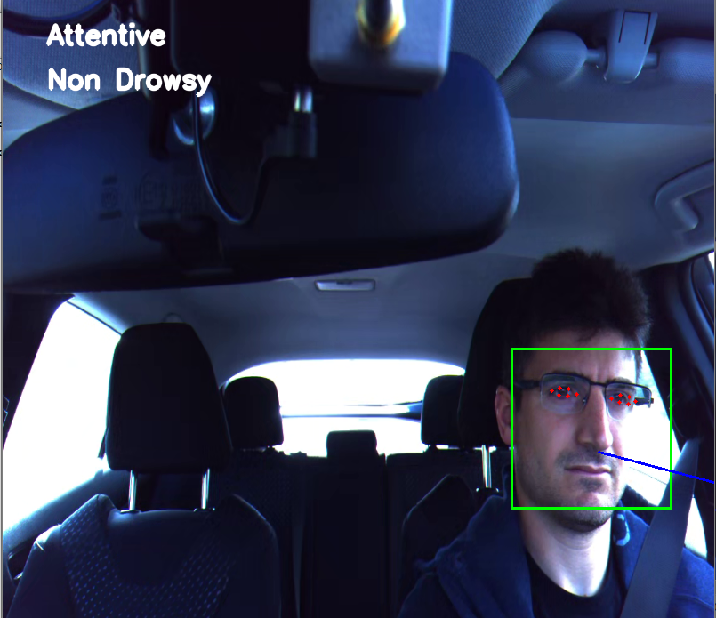

## driver-monitoring

# The approach taken is
- Face detection using dlib's face detector (using haar cascades).
- Facial landmarks detection for every detected face using dlib's predictor model that uses implementation of the paper: One Millisecond Face Alignment with an Ensemble of Regression Trees by Vahid Kazemi and Josephine Sullivan, CVPR 2014.

- Calculating eye aspect ratio using this formula: 

- Head pose estimation using cv2's solvePnP function.

# Result 
The code is tested on videos from comma.ai driver monitoring challenge.

